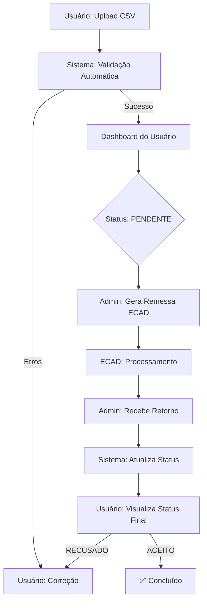

# 📘 Manual do Sistema de Fonogramas - Guia Completo

Bem-vindo ao sistema de Gestão de Fonogramas SBACEM! Este guia foi desenvolvido para orientar usuários e administradores em todas as etapas do processo, desde o cadastro inicial até o envio e validação junto ao ECAD.

---

## 🏗️ Visão Geral do Fluxo

O sistema opera em um ciclo contínuo de cadastro, validação e envio. Abaixo, o fluxo principal simplificado:

---

## 👤 Perfil: Usuário (Produtor/Editor)

Como usuário, seu principal objetivo é cadastrar seus fonogramas de forma correta para garantir a arrecadação de direitos autorais.

### 1. 📂 Importação em Massa (Upload)
A maneira mais rápida de cadastrar obras é via planilha.

1.  Acesse o menu **"Upload de Arquivos"**.
2.  **Preparação**: Baixe o modelo oficial `.xlsx` disponível na tela ou use um arquivo `.csv` no padrão exigido.
    *   *Dica: Certifique-se de que o ISRC tenha 12 caracteres (ex: BRUM72400001).*
3.  **Envio**: Arraste seu arquivo para a área pontilhada ou clique para selecionar.
4.  **Processamento**: Clique em **"Processar Arquivo"**. O sistema irá ler cada linha:
    *   ✅ **Verde**: Linhas válidas.
    *   ❌ **Vermelho**: Linhas com erros (ISRC inválido, campos obrigatórios faltando, duplicidade).
5.  **Resultado**: 
    *   Se houver erros, o sistema mostrará exatamente qual linha e qual o problema. Corrija na sua planilha e envie novamente.
    *   Se estiver tudo certo, um botão **"Confirmar Importação"** aparecerá.
6.  **Conclusão**: Clique em Confirmar. Seus fonogramas agora aparecem na lista "Meus Fonogramas" com status `PENDENTE` ou `RASCUNHO`.

### 2. 📝 Cadastro Manual
Para cadastrar apenas uma música:
1.  Vá em **"Novo Fonograma"**.
2.  Preencha o formulário detalhado (título, autores, intérpretes, ISRC).
3.  Clique em **"Salvar"**.

### 3. 📊 Acompanhamento
No seu **Dashboard**, você pode ver o status de cada fonograma:
*   🟡 **Pendente**: Cadastrado, aguardando envio pelo administrador.
*   🔵 **Enviado**: Arquivo enviado ao ECAD, aguardando resposta.
*   🟢 **Aceito**: Fonograma validado e registrado no ECAD.
*   🔴 **Recusado**: O ECAD encontrou um erro. Verifique a mensagem de erro e corrija.

---

## 🔐 Perfil: Administrador

O administrador atua como a ponte entre os usuários e o ECAD.

### 1. 📡 Gerenciar Envios (Remessa)
Sua função é agrupar fonogramas `PENDENTES` e gerar o arquivo para o ECAD.

1.  Acesse o **Painel Administrativo** > **Envios ECAD**.
2.  Clique em **"Novo Envio"**.
3.  O sistema listará todos os fonogramas prontos para envio (de todos os usuários).
4.  **Seleção**: Você pode selecionar todos ou escolher especificamente quais enviar.
5.  **Gerar Arquivo**:
    *   Escolha o formato (Excel Oficial ou .EXP Legacy).
    *   Clique em **"Gerar Envio"**.
6.  O sistema gerará um **Número de Protocolo** único e baixará o arquivo automaticamente.
7.  **Ação Externa**: Envie este arquivo manualmente pelo portal do ECAD/ABRAMUS.
8.  No sistema, o status dos fonogramas mudará automaticamente para `ENVIADO`.

### 2. 🔄 Processar Retorno
Após alguns dias, o ECAD devolve um arquivo de resposta (Retorno).

1.  Receba o arquivo de retorno do ECAD.
2.  No sistema, vá em **"Upload de Retorno"**.
3.  **Upload**: Envie o arquivo recebido.
4.  **Vínculo**: Selecione a qual "Envio" (Protocolo) este retorno se refere.
5.  **Processar**: O sistema lerá o retorno e atualizará o status de cada fonograma individualmente:
    *   Se o ECAD aceitou -> Status vira `ACEITO` 🟢.
    *   Se o ECAD recusou -> Status vira `RECUSADO` 🔴 e a mensagem de erro é salva no histórico do fonograma.

### 3. 🛠️ Gestão em Lote
Para correções rápidas em grandes volumes:
1.  Vá em **"Gerenciar Lote"**.
2.  Use os filtros para encontrar fonogramas (ex: "Todos do gênero Rock" ou "Todos do usuário X").
3.  Selecione os itens desejados.
4.  Escolha a ação: **Editar**, **Excluir** ou **Alterar Status Manualmente**.

---

## 💡 Dicas e Solução de Problemas

> **Erro: "Token CSRF hiante"**
> *   O sistema possui alta segurança. Se você deixar a página aberta por muito tempo sem uso, o token de segurança expira. Simplesmente recarregue a página (F5) e tente novamente.

> **Erro no Upload: "Formato inválido"**
> *   Verifique se as colunas da sua planilha correspondem exatamente ao modelo. Não mude o nome do cabeçalho das colunas (ex: mantenha "ISRC", não mude para "Código ISRC").

> **Dúvidas sobre o ECAD**
> *   O sistema valida apenas a *formatação* dos dados (se o CPF tem 11 dígitos, se o ISRC é válido). A validação de *direitos* (se o autor realmente existe) é feita exclusivamente pelo ECAD no processamento do retorno.

---
*Sistema desenvolvido para SBACEM - Versão 2.0 (Jan/2026)*
